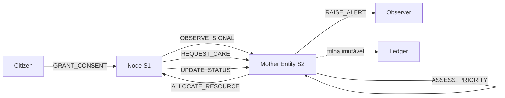
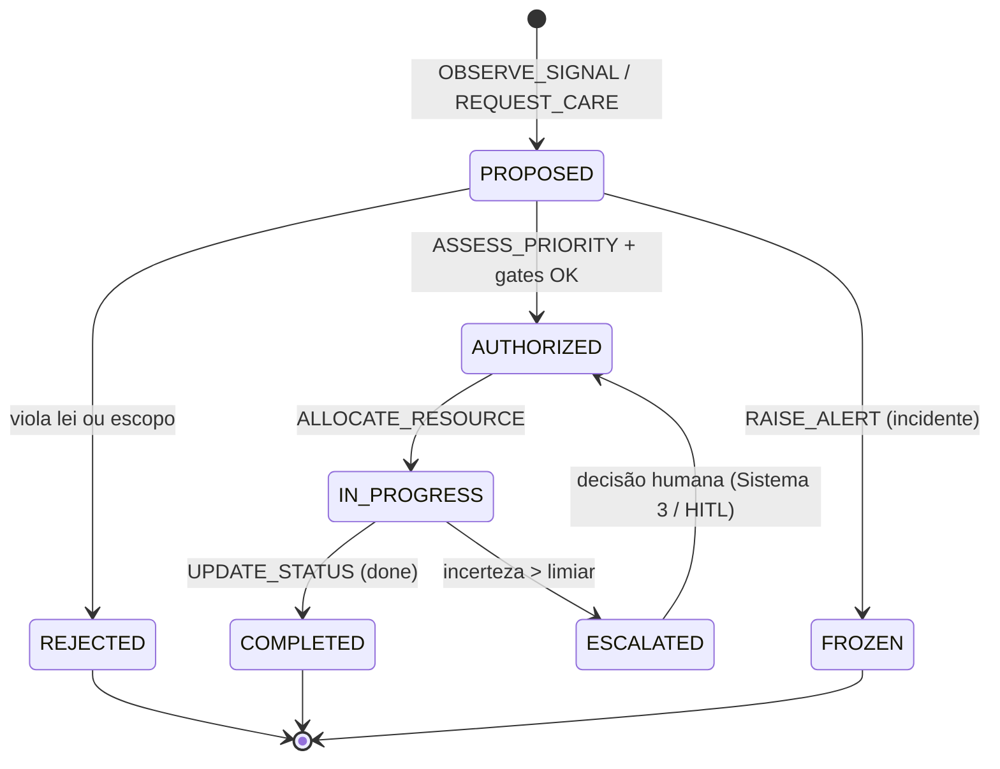

# Open UHP — Especificação Técnica

Especificação normativa do **Universal Health Protocol** (`u.health`): arquitetura, atores, fluxo, estados e exceções. Para a definição dos atores e suas obrigações, ver [Contratos](./contracts.md); para os payloads, ver [Mensagens](./messages.md).

**Princípio de design:** percepção na borda (probabilística), deliberação no núcleo (determinística), auditoria imutável. A IA **propõe**; a matemática **valida e executa**.

---

## 1. Escopo

| Responsabilidade | Fora do escopo |
| --- | --- |
| Observar sinais de saúde (clínicos, logísticos, epidemiológicos) | Descoberta/cotação/reserva de serviços e transporte de **dados** (→ [USP](https://github.com/LucasArgate/open-usp), agnóstico); execução/auditoria determinística (→ `u.core`) |
| Priorizar e orquestrar recursos com equidade | Entrega **física** de insumos/medicamentos (→ [UDP](https://github.com/LucasArgate/open-udp)) |
| Aplicar as Leis Imutáveis na deliberação | Armazenamento imutável bruto (→ Ledger) |
| Gerir consentimento e soberania do dado | Diagnóstico clínico final (→ profissional de saúde humano) |

O UHP **não** substitui prontuários ou sistemas oficiais; opera como **camada neural** que os integra.

---

## 2. Arquitetura de processo dual (S1 / S2)

Inspirada na Teoria do Processo Dual (Kahneman, 2011): *pensar rápido e devagar*.

### 2.1 Sistema 1 (S1) — Percepção rápida (borda)

| Atributo | Descrição |
| --- | --- |
| **Analogia** | Sistema nervoso simpático |
| **Velocidade** | Alta, heurística, autônoma |
| **Responsabilidade** | Ingestão, integração, detecção de anomalias, sinais fracos |
| **Memória** | Curto prazo — contexto regional imediato |
| **Limite** | Apenas **propõe**; nunca decide sozinho sobre recurso crítico |

### 2.2 Sistema 2 (S2) — Deliberação determinística (núcleo)

| Atributo | Descrição |
| --- | --- |
| **Analogia** | Córtex pré-frontal |
| **Velocidade** | Lento, ponderado, auditável |
| **Responsabilidade** | Ética, regras, otimização, auditoria, gates de lei |
| **Memória** | Longo prazo — conhecimento validado, restrições permanentes |
| **Garantia** | Toda decisão crítica é determinística e gera trilha imutável (L4) |

### 2.3 O Árbitro (bypass de emergência — L1)

Quando S1 detecta risco iminente à vida e S2 é lento demais:

```text
urgency_score ≥ limiar_crítico → S1 recebe autorização provisória de bypass
                                → ação imediata
                                → reporte determinístico ao S2 após o fato
```

Fundamentação: Lei da Supremacia do Cuidado (L1) + escalonamento preemptivo.

### 2.4 Sistema 3 — Human-in-the-Loop (HITL)

O **Sistema 3 é o *Human-in-the-Loop* (HITL)**: o escalonamento humano. Conflitos éticos irreconciliáveis ou incerteza acima do limiar matemático → decisão entregue a humano de alta confiança (médico, comitê de ética). Ver `ESCALATED` em §5.

---

## 3. Entidade Mãe e execução na borda

Nós na borda não podem receber redeploy de código a cada mudança de comportamento.

| Componente | Função |
| --- | --- |
| **Runner local** | Worker estático no Nó — relativamente imutável |
| **Entidade Mãe** | Núcleo central — emite manifesto dinâmico (`llm.txt`) |
| **`llm.txt`** | Prompt de sistema + permissões + schemas do dia/região (roteado por `partition_key`) |
| **Atualização** | Muda comportamento sem distribuir código compilado |

A Entidade Mãe publica instruções pelo transporte do USP (payload `INSTRUCTION`); o Nó devolve inferências anonimizadas (`INFERENCE`). Ver [USP](https://github.com/LucasArgate/open-usp).

---

## 4. Atores e fluxo



### Fluxo canônico

1. **Consentimento (quando há PII):** `Citizen` emite `GRANT_CONSENT` ao `Node`.
2. **Percepção:** `Node` observa sinais e emite `OBSERVE_SIGNAL` (anonimizado) e/ou `REQUEST_CARE`.
3. **Priorização:** A `Mother Entity` computa `ASSESS_PRIORITY` (determinístico).
4. **Orquestração:** A `Mother Entity` emite `ALLOCATE_RESOURCE` com equidade algorítmica.
5. **Execução:** O `Node` confirma com `UPDATE_STATUS` até `COMPLETED`.
6. **Exceção:** Surto/ruptura/fraude → `RAISE_ALERT` ao `Observer`; incerteza alta → `ESCALATED` (Sistema 3 / Human-in-the-Loop).

---

## 5. Máquina de estados



| Estado | Descrição |
| --- | --- |
| `PROPOSED` | Sinal/pedido recebido; aguarda deliberação. |
| `AUTHORIZED` | Priorizado e validado contra as Leis Imutáveis. |
| `IN_PROGRESS` | Recurso alocado; execução em curso. |
| `COMPLETED` | Cuidado/alocação concluído com trilha imutável. |
| `REJECTED` | Recusado (viola lei ou escopo); motivo determinístico. |
| `ESCALATED` | Incerteza acima do limiar → decisão humana (Sistema 3 / Human-in-the-Loop). |
| `FROZEN` | Congelado por incidente (fraude, ruptura) até resolução. |

---

## 6. Índice de Prioridade (ASSESS_PRIORITY)

A priorização é **determinística** e composta. Inspirada no Protocolo de Triagem de Manchester e em modelos de priorização multifatorial:

```text
priority_index = w1·risco_clinico
               + w2·tempo_espera
               + w3·impacto_funcional
               + w4·vulnerabilidade

faixas: P1 (crítico) · P2 (alto) · P3 (médio) · P4 (baixo)
```

| Faixa | urgency_score | Comportamento |
| --- | --- | --- |
| `P1` | ≥ 0.9 | Bypass de emergência (L1) — preempta filas inferiores |
| `P2` | 0.7 – 0.9 | Prioridade alta |
| `P3` | 0.3 – 0.7 | Fila padrão |
| `P4` | < 0.3 | Agregável / preventivo |

> Os pesos `w1..w4` e a calibração de faixas são parâmetros de **camada superior** (perfil regional), nunca alterando o axioma de que a priorização é cega a status político/comercial (L2). Ver [Extensões](./extensions.md).

---

## 7. Validação contra as Leis Imutáveis

Toda transição crítica passa por gates determinísticos:

| Lei | Gate no UHP |
| --- | --- |
| **L1 Supremacia** | `urgency_score` P1 bypassa fila de deliberação lenta |
| **L2 Equidade** | `ASSESS_PRIORITY` rejeita payload com variável política/comercial como peso |
| **L3 Soberania** | `OBSERVE_SIGNAL` sem anonimização → `REJECTED`; PII exige `GRANT_CONSENT` |
| **L4 Transparência** | Toda transição gera registro append-only; motivo de rejeição é determinístico |
| **L5 Resiliência** | Sinais `offline_capable` deliberados localmente quando o núcleo está indisponível |

Ver [Segurança](./security.md) para o detalhamento das leis.

---

## 8. Camadas de protocolo

| Camada | Protocolo | Função |
| --- | --- | --- |
| Domínio | **UHP** (`u.health`) | Observar, priorizar, orquestrar cuidado |
| Serviços + transporte de dados | [USP](https://github.com/LucasArgate/open-usp) (`u.service`) | Descobrir/cotar/reservar serviços (prestadores CLT/PJ) e transferir estado (agnóstico) entre Entidade Mãe e borda |
| Entrega física | [UDP](https://github.com/LucasArgate/open-udp) (`u.delivery`) | Mover medicamentos/vacinas/amostras/insumos (Last Mile) |
| Execução/Auditoria | `u.core` | Execução determinística + registro imutável (`ExecutionRecord`) — campo comum da holarquia |
| Auditoria | Ledger | Append-only log, hash encadeado (BLAKE3) |
| Identidade | auth_crypto | WebAuthn / gov.br — consentimento criptográfico |

---

## 9. Versionamento

| Versão | Escopo |
| --- | --- |
| **UHP v0.1** | Atores, fluxo Observe–Assess–Orchestrate, estados, gates de lei |
| **Evolução** | Novos tipos de sinal, perfis FHIR, motores epidemiológicos — **Leis Imutáveis e envelope de mensagem permanecem** (P6) |

Breaking changes exigem nova major version com coexistência temporária.

---

## 10. Referências

- Kahneman, D. *Thinking, Fast and Slow*. 2011.
- Mackway-Jones, K.; et al. *Emergency Triage* (Manchester Triage Group).
- Kermack & McKendrick (1927) — Modelo SIR.
- Garcez & Lamb (2023) — Neurosymbolic AI.
- [Open USP](https://github.com/LucasArgate/open-usp) · [Open UDP](https://github.com/LucasArgate/open-udp)
- Repositório de aplicação: [github.com/LucasArgate/uhp](https://github.com/LucasArgate/uhp)

---

*UHP v0.1.0 — especificação documental*
